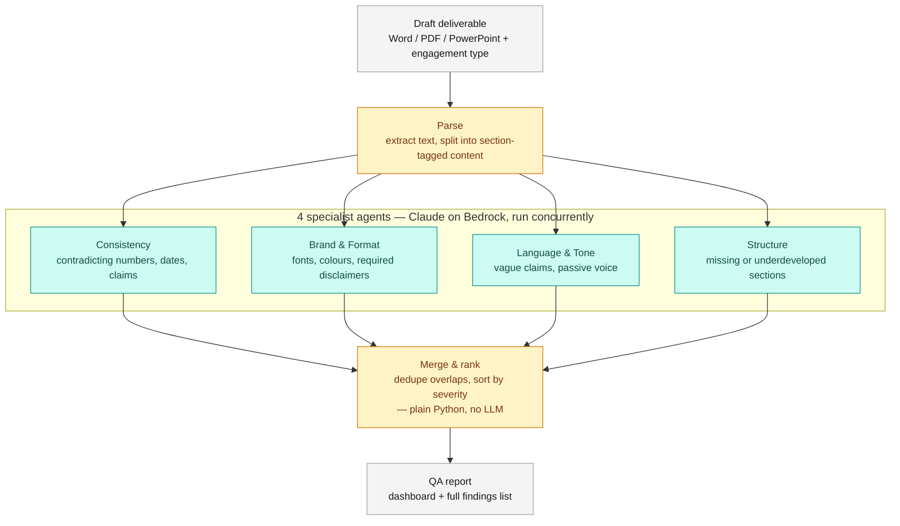

# DeliverableQA Agent

> Multi-agent quality gate for consulting deliverables — catches inconsistencies, brand/format violations, tone issues, and structural gaps before a document reaches the client.

[](https://www.python.org/)
[](https://github.com/langchain-ai/langgraph)
[](https://aws.amazon.com/bedrock/)
[](#)

Built for the Deloitte Agentathon by a 4-person team. Full build spec, agent prompts, and schema live in [`CONTEXT.md`](./CONTEXT.md).

---

## The problem

Every engagement ends the same way: a last-minute scramble to QA a 30–80 page report or deck before it reaches the client. A senior reviewer can spend 3–5 hours per deliverable hunting for mismatched numbers, wrong fonts, unsubstantiated claims, and missing sections — usually the same person who wrote it, under deadline pressure.

## The solution

An orchestrator parses a draft deliverable and dispatches it to four specialist review agents in parallel, merges and ranks their findings by severity, and renders a QA report before a human ever opens the document.

## Architecture



Amber = deterministic Python, no LLM call by default (parse and merge). Teal = the specialist agents, which always call an LLM. `CONTEXT.md`'s original design specifies an LLM-driven orchestrator for both parse and merge; parse is still plain Python, and merge defaults to plain Python too but has an opt-in LLM-driven path (`--llm-merge`) — see [Status](#status) and the Merge strategies row in Tech stack.

## Tech stack

Local-only Python + LangGraph, per the original project proposal — no cloud deployment, everything in this table is installed and running today.

| Layer | What's actually used |
|---|---|
| Orchestration runtime | Python 3.14 |
| Agent fan-out | LangGraph 1.2 — `StateGraph` with one node per specialist agent, run in parallel |
| LLM backbone | Claude via **Amazon Bedrock** (`anthropic[bedrock]` 0.120, `AsyncAnthropicBedrock`), model `global.anthropic.claude-sonnet-5` — not a plain `ANTHROPIC_API_KEY` call; see the note below |
| AWS SDK | boto3 1.43 |
| Document parsing | `python-docx` 1.2 (docx), `python-pptx` 1.0 (pptx), `PyMuPDF` 1.28 (pdf) |
| Config | YAML checklists + style rules, parsed with PyYAML 6.0 |
| Findings storage | Local JSON (`output/findings.json`) |
| Dashboard | A 3-panel live web app (`dashboard/index.html`) styled with **Tailwind CSS** (CDN) + Chart.js (CDN) — no build step. Left panel uploads a deliverable and shows the current file/refresh time; middle panel lists the 4 agents with per-agent finding counts; right panel shows the selected agent's findings. Fetches `/api/findings` on load, on Refresh, and after every analyze, so it always reflects the current `output/findings.json` without needing a rebuild. |
| Web server | **FastAPI + uvicorn** (`server.py`) — `GET /api/findings` (reads `output/findings.json` fresh off disk on every request), `DELETE /api/findings` (clears it back to the empty state), `POST /api/analyze` (accepts a docx/pptx/pdf upload + engagement type via `python-multipart` 0.0.27, runs the full pipeline synchronously via `run_qa.run()`, writes the result), plus a static mount serving `dashboard/`. One request at a time, no job queue, no auth — a real Bedrock analysis blocks the request for as long as it takes. |
| Package management | **uv** — `pyproject.toml` + `uv.lock` (see Getting started); replaced the old `requirements.txt` + `venv`/`pip` workflow. |
| Merge strategies | Default is deterministic (`orchestrator/merge.py` — `difflib` similarity + location match, no LLM call). Optional LLM-driven merge (`orchestrator/llm_merge.py`, `--llm-merge`) calls Claude with `prompts/orchestrator.md`'s PHASE 2 instructions instead, falling back to the deterministic merge on any failure. |
| Delta / re-run mode | `orchestrator/merge.py`'s `compute_delta()` compares a run's findings against a prior `findings.json` (matched by location + description similarity) into resolved/still-open/new. |
| Testing | pytest + pytest-asyncio, 69 tests, zero live Bedrock calls (the client is mocked throughout) |
| Deployment | None — runs locally on `127.0.0.1`, no client data leaves the machine |

> **Why Bedrock, and why forced tool-use instead of structured outputs:** this team's Bedrock IAM policy denies Opus/Fable, and Sonnet needs the `global.` cross-region inference-profile prefix to resolve at all. On top of that, this Bedrock route doesn't support `output_config.format` or `strict` tool schemas, and a `$ref`/`$defs`-based Pydantic schema made `claude-sonnet-5` unreliably stringify nested fields instead of emitting real JSON (~90% failure rate in testing). `agents/schema.py` works around both: forced `tool_choice` against a `$ref`-inlined flat schema, plus a small JSON-repair step for the residual stringified-field cases. `orchestrator/llm_merge.py` reuses the exact same pattern for its own schema.

## Repo structure

```
deliverableqa-agent/
├── run_qa.py                     # CLI entry point: parse → dispatch → merge → report → write findings.json
│                                 #   (--previous-findings for delta, --llm-merge to opt into LLM merge)
├── server.py                     # FastAPI app: GET/DELETE /api/findings (reads/clears output/findings.json,
│                                 #   live off disk, no caching), POST /api/analyze (upload + run pipeline),
│                                 #   serves dashboard/ as static root
├── pyproject.toml                # uv-managed deps + dev group (pytest, pytest-asyncio)
├── uv.lock
├── .python-version
├── pytest.ini
├── CONTEXT.md                    # full build spec: architecture, all 5 system prompts, schema
│
├── orchestrator/                 # non-agent plumbing
│   ├── parse.py                  # docx/pptx/pdf -> list[Section]; raises DocumentParseError on
│   │                             #   empty/corrupt input instead of failing silently
│   ├── dispatch.py                # LangGraph graph: fans the 4 agents out, runs them concurrently
│   ├── merge.py                   # dedup + severity sort + dashboard shaping (plain Python, no LLM)
│   │                             #   + compute_delta() for re-run comparisons
│   └── llm_merge.py               # opt-in LLM-driven merge (prompts/orchestrator.md PHASE 2),
│                                 #   falls back to merge.py on any failure
│
├── agents/                       # one Claude call per specialist, all sharing one schema
│   ├── schema.py                 # Pydantic models + the Bedrock call wrapper (forced tool-use,
│   │                             #   $ref-inlined schema, JSON-repair — see Tech stack above)
│   ├── consistency.py
│   ├── brand_format.py
│   ├── language_tone.py
│   └── structure.py
│
├── prompts/                      # the 5 system prompts, versioned as .md, loaded at runtime
│   ├── consistency.md
│   ├── brand_format.md
│   ├── language_tone.md
│   ├── structure.md
│   └── orchestrator.md           # PHASE 2 instructions used by orchestrator/llm_merge.py (opt-in path)
│
├── config/                       # per-engagement-type rules, editable without touching code
│   ├── checklists/
│   │   ├── advisory.yaml
│   │   ├── audit.yaml
│   │   ├── tax.yaml
│   │   └── consulting.yaml
│   └── style_rules.yaml          # fonts, colours, required disclaimers
│
├── schema/
│   └── finding.schema.json       # the shared finding shape as plain JSON Schema
│
├── dashboard/
│   └── index.html                # 3-panel Tailwind (CDN) + Chart.js app: upload/clear (left),
│                                 #   agent nav (middle), findings (right); talks to server.py's
│                                 #   /api/findings + /api/analyze, no build step
│
├── samples/                      # one planted-error sample deliverable per engagement type
│   ├── generate_sample.py            # advisory — 3 planted errors
│   ├── advisory_sample.docx
│   ├── generate_audit_sample.py      # audit — 3 planted errors
│   ├── audit_sample.docx
│   ├── generate_tax_sample.py        # tax — 3 planted errors
│   ├── tax_sample.docx
│   ├── generate_consulting_sample.py # consulting — 3 planted errors
│   └── consulting_sample.docx
│
├── tests/                        # pytest suite, 69 tests — Bedrock client mocked throughout,
│   │                             #   zero live API calls
│   ├── test_parse.py             # docx/pptx/pdf happy paths + empty/corrupt/unsupported edge cases
│   ├── test_merge.py             # dedup, severity sort, compute_delta matching/thresholds
│   ├── test_schema_repair.py     # JSON-repair against real malformed Bedrock output shapes
│   ├── test_run_agent.py         # agents/schema.py's run_agent(), fully mocked
│   ├── test_llm_merge.py         # llm_merge.py's fallback-on-any-failure guarantee
│   └── test_server.py            # /api/analyze + /api/findings routes, run() mocked throughout
│
├── .agents/skills/deliverableqa-kickoff/   # kickoff skill, discovered by Pi
└── .claude/skills/deliverableqa-kickoff/   # kickoff skill, discovered by Claude Code (identical copy)
```

## Findings schema

Every agent returns findings in one shared shape:

```json
{
  "agent": "consistency | brand_format | language_tone | structure",
  "findings": [
    {
      "id": "string",
      "location": { "page": "int | null", "section": "string" },
      "severity": "critical | warning | suggestion",
      "category": "string",
      "description": "string",
      "evidence": "string",
      "proposed_fix": "string"
    }
  ]
}
```

**Severity:** `critical` — a partner would reject the deliverable · `warning` — should be fixed before sending · `suggestion` — optional polish.

## Getting started

Requires Python 3.14, [`uv`](https://docs.astral.sh/uv/) for dependency management, and AWS credentials for a Bedrock account with access to `global.anthropic.claude-sonnet-5` (see the tech stack note above — Opus/Fable and non-`global.` model IDs are not guaranteed to work on every account).

```bash
git clone https://github.com/arifbazli/deliverableqa-agent.git
cd deliverableqa-agent

uv sync    # creates .venv/ and installs every dependency from uv.lock, incl. dev tools

# AWS credentials must be resolvable via the standard boto3 chain
# (env vars, ~/.aws/credentials, or an active AWS SSO/profile session)
```

`uv sync` replaces the old `python -m venv .venv` + `pip install -r requirements.txt` — there's no `requirements.txt` anymore, `pyproject.toml` + `uv.lock` are the source of truth. Use `uv add <package>` to add a new dependency (writes to both files) rather than editing them by hand.

Engagement type is one of `advisory`, `audit`, `tax`, `consulting` — each maps to its own checklist under `config/checklists/`.

### Run an analysis

```bash
# generate a sample deliverable with 3 planted errors (optional — one is committed already
# per engagement type: advisory_sample.docx, audit_sample.docx, tax_sample.docx, consulting_sample.docx)
uv run python samples/generate_sample.py

uv run python run_qa.py samples/advisory_sample.docx --engagement-type advisory
```

This writes `output/findings.json`.

### View the report

```bash
uv run --native-tls python server.py
# open http://127.0.0.1:8000
```

(Drop `--native-tls` if your network doesn't sit behind a TLS-intercepting proxy — it's only needed to make `uv`/`pip` trust the system certificate store instead of its bundled one.)

The dashboard has three panels: **left** to upload a new deliverable (or clear the current findings back to an empty state), **middle** to pick which agent's findings to view, **right** to read them. It fetches `output/findings.json` live from the server on every page load, on **Refresh**, and automatically after a successful upload — no rebuild step, and the server itself never needs to be restarted between analyses. You can also drive an analysis from the CLI (`run_qa.py`, above) and just hit Refresh in the browser to see the result — the upload form and the CLI write to the same `output/findings.json`.

Two optional flags on `run_qa.py`:

```bash
# Delta mode: compare this run against a prior findings.json for the same document
# (e.g. after applying fixes) — adds a "delta" section (resolved/still_open/new) that
# the dashboard also renders
uv run python run_qa.py samples/advisory_sample.docx --engagement-type advisory \
  --previous-findings output/findings.json

# LLM-driven merge: one extra Bedrock call to catch semantic duplicates worded very
# differently across agents, instead of the default deterministic dedup. Falls back
# to the deterministic merge automatically if the call fails.
uv run python run_qa.py samples/advisory_sample.docx --engagement-type advisory --llm-merge
```

### Running the tests

```bash
uv run --native-tls pytest
```

69 tests, no AWS credentials required — the Bedrock client is mocked throughout, so the suite runs offline.

## Status

**Built and verified end-to-end:**
- Document parsing for docx/pptx/pdf into section-tagged text, with defensive error handling: `orchestrator/parse.py` raises a clear `DocumentParseError` on empty, corrupted, or unreadable input instead of silently returning nothing or leaking a library traceback
- All 4 specialist agents, calling Claude on Bedrock via forced tool-use, each producing schema-conformant findings
- LangGraph fan-out/fan-in across all 4 agents
- Deterministic merge: cross-agent dedup (`difflib` similarity on same-location findings), severity sort, dashboard aggregation
- Optional LLM-driven merge (`orchestrator/llm_merge.py`, `--llm-merge`), verified via a live A/B test to catch cross-agent duplicates worded very differently across sections that the deterministic merge structurally cannot see — always falls back to the deterministic merge on any API error, malformed response, or validation failure
- Delta/re-run mode (`compute_delta()` in `orchestrator/merge.py`), tuned against real two-pass Bedrock output, with dedicated dashboard rendering: passing `--previous-findings <path>` on the CLI adds a resolved/still-open/new breakdown that the regenerated dashboard renders as its own card. **Known limitation:** a finding that gets both heavily reworded *and* relabeled to a different section between runs can still show up as one "resolved" + one "new" instead of matching as "still open" — the similarity threshold was tuned against real data to minimize this without risking false-merging genuinely unrelated findings, but it isn't eliminated.
- One planted-error sample deliverable per engagement type (`samples/{advisory,audit,tax,consulting}_sample.docx`, 3 planted errors each), all verified end-to-end against real Bedrock calls with every planted error caught
- Automated test suite: 69 pytest tests (`pytest.ini`, `asyncio_mode = auto`) covering parse edge cases, merge/dedup/delta logic, JSON-repair, `run_agent()`/`llm_merge`'s fallback guarantee, and the `/api/analyze`/`/api/findings` server routes — zero live Bedrock calls, the client is mocked throughout.
- Live 3-panel dashboard (`dashboard/index.html` + `server.py`): upload a deliverable and pick an engagement type from the left panel (`POST /api/analyze` runs the full pipeline synchronously and writes `output/findings.json`), browse findings by agent in the middle/right panels, and clear the current findings back to an empty state via the header's Clear button (`DELETE /api/findings`). `GET /api/findings` reads `output/findings.json` fresh off disk on every request — no caching, no rebuild step. Verified end-to-end via real uploads through the browser (not just the CLI): confirmed the filename/finding counts/agent breakdown all update correctly after analyze, after clicking Refresh, and after a full page reload, in both light and dark mode.
- CLI entry point (`run_qa.py`), tested end-to-end via `uv run`, including `--previous-findings` and `--llm-merge`
- `uv`-based dependency management (`pyproject.toml` + `uv.lock` + `.python-version`), replacing the old `requirements.txt` + `venv`/`pip` workflow — verified via a clean `uv sync` + `uv run pytest` pass after deleting the old `.venv/`

**Known gaps:**
- **Deterministic merge is the default, by design, not because the LLM path is unfinished.** `prompts/orchestrator.md`'s PHASE 2 instructions only run under the opt-in `--llm-merge` flag — every run still pays for one extra Bedrock call and adds latency, which isn't worth it for the common case where agents rarely produce cross-section duplicates. Reach for `--llm-merge` specifically when you suspect two agents flagged the same underlying issue under different section labels or wording (see Merge strategies above for what it catches that the deterministic pass structurally can't).
- **Scanned/image-only documents aren't supported — by design, not by oversight.** `parse.py` extracts text via `python-docx`/`python-pptx`/`PyMuPDF`, none of which do OCR. A scanned PDF or an image-based deck with no extractable text now fails fast with a clear `DocumentParseError` ("OCR isn't supported") instead of silently producing an empty or misleading report — that failure mode was the actual bug fixed; adding OCR itself would mean a new system dependency (e.g. Tesseract) and is a deliberately separate decision, not assumed as part of this fix.
- **No auth, no job queue, no concurrency guard.** `/api/analyze` is a plain async endpoint with no lock — two uploads submitted at the same time would run concurrently and race writing `output/findings.json`, rather than queue. Fine for the intended local single-user use; a second person hitting the same server (or one impatient double-click) is the actual risk, not something this version guards against.
- **`server.py` must be restarted manually if the machine reboots.** There's no autostart wired up by default; see [Auto-start on login (Windows)](#auto-start-on-login-windows) below if you want it to survive a reboot without manual intervention.

## Auto-start on login (Windows)

To have `server.py` launch automatically whenever you log in (so it survives a reboot without you remembering to run it), register it as a Windows scheduled task using `uv run`'s `--directory` flag so it always runs against this project regardless of the shell's current directory:

```powershell
schtasks /create /tn "DeliverableQA Dashboard" /tr "C:\Users\muhaabubakar\.local\bin\uv.exe run --directory C:\Users\muhaabubakar\PyCharmMiscProject\deliverableqa-agent python server.py" /sc onlogon /rl limited
```

- `/sc onlogon` — runs at login, not on a timer.
- `/rl limited` — runs with your normal (non-admin) privileges, the same as running it manually.
- Adjust the two paths if your `uv` install location or checkout path differ from the ones shown — confirm with `(Get-Command uv).Source` and `(Get-Location).Path` from inside the repo.

To remove it later: `schtasks /delete /tn "DeliverableQA Dashboard" /f`. To check it's registered: `schtasks /query /tn "DeliverableQA Dashboard"`.

## Agent skill (Pi + Claude Code)

The project context, agent prompts, and deployment setup are packaged as a reusable skill, discoverable by both coding agents used on this project:

```
.agents/skills/deliverableqa-kickoff/   # discovered by Pi (pi.dev)
.claude/skills/deliverableqa-kickoff/   # discovered by Claude Code
```

Both are identical copies (`SKILL.md`, `assets/CONTEXT.md`, `references/deployment-setup.md`). There's no symlink between them — if the skill content changes, update both paths in the same commit to keep them in sync.

> This repo is being built incrementally with **Claude Code**, working through `CONTEXT.md` step by step rather than one large autonomous generation.
