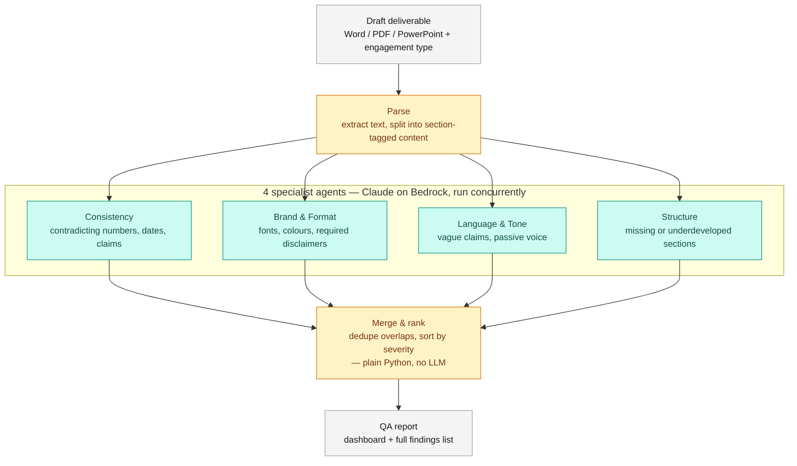

# DeliverableQA Agent

> Multi-agent quality gate for consulting deliverables — catches inconsistencies, brand/format violations, tone issues, and structural gaps before a document reaches the client.

[](https://www.python.org/)
[](https://github.com/langchain-ai/langgraph)
[](https://aws.amazon.com/bedrock/)
[](#)

Built for the Deloitte Agentathon. Full build spec, agent prompts, and schema live in [`CONTEXT.md`](./CONTEXT.md).

---

## The problem

QA-ing a 30–80 page deliverable before it reaches the client eats 3–5 hours per document — usually spent by the same person who wrote it, hunting for mismatched numbers, wrong fonts, unsubstantiated claims, and missing sections.

## The solution

An orchestrator parses a draft deliverable, dispatches it to four specialist review agents in parallel, merges and ranks their findings by severity, and renders a report before a human opens the document.

## Architecture



Amber = deterministic Python (no LLM call). Teal = agents, which always call Claude. Merge has an opt-in LLM-driven path too (`--llm-merge`) — see [Known limitations](#known-limitations).

## Tech stack

Local-only — no cloud deployment, no client data leaves the machine.

| Layer | What's used |
|---|---|
| Runtime | Python 3.14, orchestrated with LangGraph (parallel fan-out to 4 agents) |
| LLM | Claude via Amazon Bedrock, model `global.anthropic.claude-sonnet-5`, forced tool-use for structured output |
| Parsing | `python-docx`, `python-pptx`, `PyMuPDF` (+ Claude-vision OCR fallback for scanned/image-only docx, pptx, and pdf) |
| Merge | Deterministic dedup by default (`orchestrator/merge.py`); optional `--llm-merge` for semantic cross-section dedup (`orchestrator/llm_merge.py`) |
| Dashboard | `dashboard/index.html` — Tailwind CDN + Chart.js, no build step |
| Server | FastAPI (`server.py`) — upload/analyze, findings, clear endpoints |
| Package mgmt | `uv` (`pyproject.toml` + `uv.lock`) |
| Tests | pytest, 92 tests, Bedrock client fully mocked |

> Forced tool-use instead of structured outputs: this Bedrock route doesn't support `strict` schemas, and a `$ref`-based schema made Claude stringify nested fields unreliably. See `agents/schema.py`.

## Repo structure

```
deliverableqa-agent/
├── run_qa.py              # CLI: parse -> agents -> merge -> report -> findings.json
├── server.py              # FastAPI: /api/findings, /api/analyze, /api/clear + dashboard
├── start-hidden.ps1       # Windows Startup-folder launcher (see Auto-start below)
├── pyproject.toml / uv.lock / .python-version
├── CONTEXT.md             # full build spec, agent prompts, schema
│
├── orchestrator/
│   ├── parse.py           # docx/pptx/pdf -> sections
│   ├── dispatch.py        # LangGraph fan-out to 4 agents
│   ├── merge.py           # dedup, severity sort, delta
│   └── llm_merge.py       # opt-in LLM-driven dedup (--llm-merge)
│
├── agents/                # one Claude call per specialist
│   ├── schema.py          # shared Pydantic models + Bedrock call wrapper
│   ├── consistency.py
│   ├── brand_format.py
│   ├── language_tone.py
│   └── structure.py
│
├── prompts/                # versioned system prompts (.md)
├── config/                 # per-engagement checklists + style rules
├── schema/finding.schema.json
├── dashboard/index.html    # 3-panel Tailwind + Chart.js app
├── samples/                # planted-error sample deliverable per engagement type
├── tests/                  # pytest suite, 92 tests
│
├── .agents/skills/deliverableqa-kickoff/   # kickoff skill (Pi)
└── .claude/skills/deliverableqa-kickoff/   # kickoff skill (Claude Code)
```

## Findings schema

```json
{
  "agent": "consistency | brand_format | language_tone | structure",
  "findings": [
    {
      "id": "string",
      "location": { "page": "int | null", "section": "string" },
      "severity": "critical | warning | suggestion",
      "category": "string",
      "description": "string",
      "evidence": "string",
      "proposed_fix": "string"
    }
  ]
}
```

**Severity:** `critical` — a partner would reject the deliverable · `warning` — should be fixed before sending · `suggestion` — optional polish.

## Getting started

Requires Python 3.14, [`uv`](https://docs.astral.sh/uv/), and AWS credentials for a Bedrock account with access to `global.anthropic.claude-sonnet-5`.

```bash
git clone https://github.com/arifbazli/deliverableqa-agent.git
cd deliverableqa-agent
uv sync
```

Run an analysis:

```bash
uv run python run_qa.py samples/advisory_sample.docx --engagement-type advisory
```

Engagement types: `advisory`, `audit`, `tax`, `consulting`.

View the dashboard:

```bash
uv run python server.py
# open http://127.0.0.1:8000
```

Upload a document from the dashboard, or run the CLI and hit **Refresh** — both write to the same `output/findings.json`.

Optional `run_qa.py` flags:
- `--previous-findings <path>` — adds a resolved/still-open/new delta vs. a prior run
- `--llm-merge` — one extra Bedrock call to catch cross-section duplicates the default merge can't see (see [Known limitations](#known-limitations))

Run tests:

```bash
uv run pytest
```

92 tests, no AWS credentials required — the Bedrock client is mocked throughout.

> Add `--native-tls` to any `uv run`/`uv sync` command if you're behind a TLS-intercepting corporate proxy.

## Auto-start on login (Windows)

`start-hidden.ps1` (repo root) launches the server via `Start-Process -WindowStyle Hidden` targeting `uv.exe` directly — no wrapping console process stays alive for the server's session, so even if a window briefly flashes (a known `-WindowStyle Hidden` quirk at logon time) and gets closed, the server keeps running independently. Logs go to `server.log` (stdout) and `server-error.log` (stderr) since there's no console to watch.

```powershell
$startup = [Environment]::GetFolderPath("Startup")
$lnkPath = Join-Path $startup "DeliverableQA-Dashboard.lnk"
$sh = New-Object -ComObject WScript.Shell
$lnk = $sh.CreateShortcut($lnkPath)
$lnk.TargetPath = "C:\Windows\System32\WindowsPowerShell\v1.0\powershell.exe"
$lnk.Arguments = '-WindowStyle Hidden -ExecutionPolicy Bypass -File "C:\path\to\deliverableqa-agent\start-hidden.ps1"'
$lnk.WorkingDirectory = "C:\path\to\deliverableqa-agent"
$lnk.Save()
```

- Works without admin rights — Task Scheduler and Windows Services both require elevation that's typically Group Policy-blocked on corporate machines; this Startup-folder `.lnk` needs neither.
- Verified the actual failure mode this fixes: an earlier version had the server run inline inside the `.lnk`'s own hidden `powershell.exe`, which showed a persistent visible window on every real reboot (not just a brief flash) and died when that window was closed. Confirmed the fix by killing the process that would carry any visible window (`uv.exe`) outright — the server (its `python.exe` child) kept running and serving requests regardless.
- AWS credentials must be persisted as User/Machine environment variables (`[Environment]::SetEnvironmentVariable(...)`) — a freshly-launched process won't inherit credentials set only in one terminal session.
- Remove by deleting the `.lnk` from `shell:startup`.

## Known limitations

- **Scanned/image-only documents are OCR'd via Claude vision** — a PDF with no extractable text has each page rendered to an image and transcribed; a `.docx`/`.pptx` with no text has its embedded picture(s) transcribed directly (no page-rendering primitive needed for those formats). All three reuse the same Bedrock client/model already used for review — no new dependency, service, or credential. Measured on a real fixture: byte-accurate transcription, ~$0.0075 and ~2-6s per page/image/slide. Only fires when extraction would otherwise come back with nothing usable — a mostly-real-text document with one scanned page or slide mixed in is unaffected either way.
- **Single local user** — no auth, no job queue; concurrent uploads can race.
- **`--llm-merge` is opt-in** — roughly 2x latency and ~$0.09/call; only worth it when you suspect a cross-section duplicate the default merge structurally can't see.
- **Some server errors return a bare HTTP 500** — check `server.log` (or terminal output) for the real traceback.
- **Delta matching (`--previous-findings`) can miss a finding that's both reworded and relabeled to a new section between runs.**

## Agent skill (Pi + Claude Code)

Project context, prompts, and schema are packaged as a reusable skill under `.agents/skills/deliverableqa-kickoff/` (Pi) and `.claude/skills/deliverableqa-kickoff/` (Claude Code) — identical copies, kept in sync manually.
