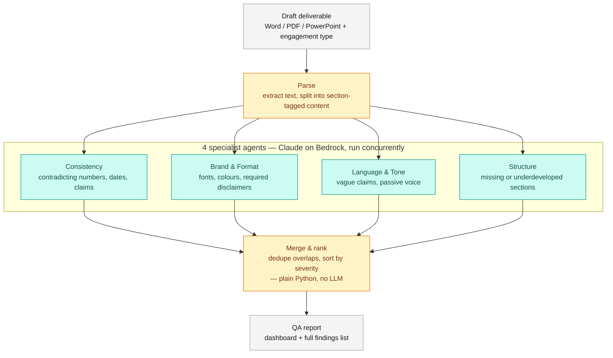

# DeliverableQA Agent

> Multi-agent quality gate for consulting deliverables — catches inconsistencies, brand/format violations, tone issues, and structural gaps before a document reaches the client.

[](https://www.python.org/)
[](https://github.com/langchain-ai/langgraph)
[](https://aws.amazon.com/bedrock/)
[](#)

Built for the Deloitte Agentathon by a 4-person team. Full build spec, agent prompts, and schema live in [`CONTEXT.md`](./CONTEXT.md).

---

## The problem

Every engagement ends the same way: a last-minute scramble to QA a 30–80 page report or deck before it reaches the client. A senior reviewer can spend 3–5 hours per deliverable hunting for mismatched numbers, wrong fonts, unsubstantiated claims, and missing sections — usually the same person who wrote it, under deadline pressure.

## The solution

An orchestrator parses a draft deliverable and dispatches it to four specialist review agents in parallel, merges and ranks their findings by severity, and renders a QA report before a human ever opens the document.

## Architecture



Amber = deterministic Python, no LLM call (parse and merge). Teal = the only 4 steps that actually call an LLM (the specialist agents). This distinction matters: `CONTEXT.md`'s original design specifies an LLM-driven orchestrator for both parse and merge, but the code that exists today does both in plain Python — see [Status](#status).

## Tech stack

Local-only Python + LangGraph, per the original project proposal — no cloud deployment, everything in this table is installed and running today.

| Layer | What's actually used |
|---|---|
| Orchestration runtime | Python 3.14 |
| Agent fan-out | LangGraph 1.2 — `StateGraph` with one node per specialist agent, run in parallel |
| LLM backbone | Claude via **Amazon Bedrock** (`anthropic[bedrock]` 0.120, `AsyncAnthropicBedrock`), model `global.anthropic.claude-sonnet-5` — not a plain `ANTHROPIC_API_KEY` call; see the note below |
| AWS SDK | boto3 1.43 |
| Document parsing | `python-docx` 1.2 (docx), `python-pptx` 1.0 (pptx), `PyMuPDF` 1.28 (pdf) |
| Config | YAML checklists + style rules, parsed with PyYAML 6.0 |
| Findings storage | Local JSON (`output/findings.json`) |
| Dashboard | Single-page HTML + Chart.js (CDN), no build step |
| Deployment | None — runs locally, no client data leaves the machine |

> **Why Bedrock, and why forced tool-use instead of structured outputs:** this team's Bedrock IAM policy denies Opus/Fable, and Sonnet needs the `global.` cross-region inference-profile prefix to resolve at all. On top of that, this Bedrock route doesn't support `output_config.format` or `strict` tool schemas, and a `$ref`/`$defs`-based Pydantic schema made `claude-sonnet-5` unreliably stringify nested fields instead of emitting real JSON (~90% failure rate in testing). `agents/schema.py` works around both: forced `tool_choice` against a `$ref`-inlined flat schema, plus a small JSON-repair step for the residual stringified-field cases.

## Repo structure

```
deliverableqa-agent/
├── run_qa.py                     # CLI entry point: parse → dispatch → merge → report
├── requirements.txt
├── CONTEXT.md                    # full build spec: architecture, all 5 system prompts, schema
│
├── orchestrator/                 # non-agent plumbing
│   ├── parse.py                  # docx/pptx/pdf -> list[Section] (text + page/slide number)
│   ├── dispatch.py               # LangGraph graph: fans the 4 agents out, runs them concurrently
│   └── merge.py                  # dedup + severity sort + dashboard shaping — plain Python, no LLM
│
├── agents/                       # one Claude call per specialist, all sharing one schema
│   ├── schema.py                 # Pydantic models + the Bedrock call wrapper (forced tool-use,
│   │                             #   $ref-inlined schema, JSON-repair — see Tech stack above)
│   ├── consistency.py
│   ├── brand_format.py
│   ├── language_tone.py
│   └── structure.py
│
├── prompts/                      # the 5 system prompts, versioned as .md, loaded at runtime
│   ├── consistency.md
│   ├── brand_format.md
│   ├── language_tone.md
│   ├── structure.md
│   └── orchestrator.md           # written but unused — merge.py does this step in plain Python (see Status)
│
├── config/                       # per-engagement-type rules, editable without touching code
│   ├── checklists/
│   │   ├── advisory.yaml
│   │   ├── audit.yaml
│   │   ├── tax.yaml
│   │   └── consulting.yaml
│   └── style_rules.yaml          # fonts, colours, required disclaimers
│
├── schema/
│   └── finding.schema.json       # the shared finding shape as plain JSON Schema
│
├── dashboard/
│   └── index.html                # single-page report, reads findings.json, no build step
│
├── samples/
│   ├── generate_sample.py        # builds a sample deliverable with 3 planted errors
│   └── advisory_sample.docx
│
├── .agents/skills/deliverableqa-kickoff/   # kickoff skill, discovered by Pi
└── .claude/skills/deliverableqa-kickoff/   # kickoff skill, discovered by Claude Code (identical copy)
```

## Findings schema

Every agent returns findings in one shared shape:

```json
{
  "agent": "consistency | brand_format | language_tone | structure",
  "findings": [
    {
      "id": "string",
      "location": { "page": "int | null", "section": "string" },
      "severity": "critical | warning | suggestion",
      "category": "string",
      "description": "string",
      "evidence": "string",
      "proposed_fix": "string"
    }
  ]
}
```

**Severity:** `critical` — a partner would reject the deliverable · `warning` — should be fixed before sending · `suggestion` — optional polish.

## Getting started

Requires Python 3.14 and AWS credentials for a Bedrock account with access to `global.anthropic.claude-sonnet-5` (see the tech stack note above — Opus/Fable and non-`global.` model IDs are not guaranteed to work on every account).

```bash
git clone https://github.com/arifbazli/deliverableqa-agent.git
cd deliverableqa-agent

python -m venv .venv
.venv\Scripts\activate        # Windows — use `source .venv/bin/activate` on macOS/Linux
pip install -r requirements.txt

# AWS credentials must be resolvable via the standard boto3 chain
# (env vars, ~/.aws/credentials, or an active AWS SSO/profile session)

# generate a sample deliverable with 3 planted errors (optional — one is committed already)
python samples/generate_sample.py

# run the pipeline
python run_qa.py samples/advisory_sample.docx --engagement-type advisory
```

This writes `output/findings.json`. Engagement type is one of `advisory`, `audit`, `tax`, `consulting` — each maps to its own checklist under `config/checklists/`. To view the report:

```bash
cp output/findings.json dashboard/findings.json    # dashboard fetches this relative to itself
python -m http.server 8000 --directory dashboard
# open http://localhost:8000
```

## Status

**Built and verified end-to-end:**
- Document parsing for docx/pptx/pdf into section-tagged text
- All 4 specialist agents, calling Claude on Bedrock via forced tool-use, each producing schema-conformant findings
- LangGraph fan-out/fan-in across all 4 agents
- Deterministic merge: cross-agent dedup (`difflib` similarity on same-location findings), severity sort, dashboard aggregation
- Single-page dashboard (light/dark, grouped and table views) rendering real pipeline output
- CLI entry point (`run_qa.py`), tested against a fresh venv end-to-end

**Not yet built:**
- The orchestrator's merge/rank step is plain Python, not an LLM call — `prompts/orchestrator.md` is written but unused. The original design in `CONTEXT.md` describes an LLM-driven orchestrator phase for merge/report; the deterministic version was faster to ship and has been sufficient so far, but semantic dedup edge cases (same underlying error, worded very differently by two agents) may need it.
- No automated test suite — verification so far is manual, run against one sample deliverable (`samples/advisory_sample.docx`, advisory engagement type) with 3 planted errors
- Only one sample deliverable exists; `audit`, `tax`, and `consulting` checklists are written but untested against a real document
- No re-run/delta mode (comparing a QA pass against a prior one after fixes are applied) — `CONTEXT.md`'s orchestrator spec calls for this, not implemented
- No handling for documents that don't map cleanly to the section-per-heading assumption `parse.py` makes (e.g. decks with no text-frame titles, scanned PDFs)

## Agent skill (Pi + Claude Code)

The project context, agent prompts, and deployment setup are packaged as a reusable skill, discoverable by both coding agents used on this project:

```
.agents/skills/deliverableqa-kickoff/   # discovered by Pi (pi.dev)
.claude/skills/deliverableqa-kickoff/   # discovered by Claude Code
```

Both are identical copies (`SKILL.md`, `assets/CONTEXT.md`, `references/deployment-setup.md`). There's no symlink between them — if the skill content changes, update both paths in the same commit to keep them in sync.

> This repo is being built incrementally with **Claude Code**, working through `CONTEXT.md` step by step rather than one large autonomous generation.
