# DeliverableQA Agent

> Multi-agent quality gate for consulting deliverables — catches inconsistencies, brand/format violations, tone issues, and structural gaps before a document reaches the client.

[](https://workers.cloudflare.com/)
[](https://www.typescriptlang.org/)
[](https://bun.sh/)
[](#)

Built for the Deloitte Agentathon by a 4-person team. Full build spec, agent prompts, and schema live in [`CONTEXT.md`](./CONTEXT.md).

---

## The problem

Every engagement ends the same way: a last-minute scramble to QA a 30–80 page report or deck before it reaches the client. A senior reviewer can spend 3–5 hours per deliverable hunting for mismatched numbers, wrong fonts, unsubstantiated claims, and missing sections — usually the same person who wrote it, under deadline pressure.

## The solution

An orchestrator dispatches a draft deliverable to four specialist review agents in parallel, merges and ranks their findings by severity, and renders a QA report before a human ever opens the document.

## Architecture

```mermaid
%%{init: {'theme':'base', 'themeVariables': {'fontFamily': 'system-ui, sans-serif', 'fontSize': '14px', 'lineColor': '#8a8a85', 'edgeLabelBackground':'transparent'}}}%%
flowchart LR
    A["Draft deliverable<br/><span style='font-size:11px'>Word · PDF · PPTX</span>"]:::io --> B

    B["Orchestrator<br/><span style='font-size:11px'>parse & dispatch</span>"]:::orch --> C1
    B --> C2
    B --> C3
    B --> C4

    subgraph agents [" Specialist agents — parallel "]
        direction TB
        C1["Consistency<br/><span style='font-size:11px'>numbers, dates, claims</span>"]:::agent
        C2["Brand / Format<br/><span style='font-size:11px'>fonts, colours, disclaimers</span>"]:::agent
        C3["Language / Tone<br/><span style='font-size:11px'>clarity, unsubstantiated claims</span>"]:::agent
        C4["Structure<br/><span style='font-size:11px'>required sections</span>"]:::agent
    end

    C1 --> D
    C2 --> D
    C3 --> D
    C4 --> D

    D["Orchestrator<br/><span style='font-size:11px'>merge, dedupe & rank</span>"]:::orch --> E
    E["QA report<br/><span style='font-size:11px'>dashboard + detailed findings</span>"]:::out --> F
    F["Human review<br/><span style='font-size:11px'>apply fixes</span>"]:::io -.->|"&#8635; re-run after fixes"| A

    classDef io fill:#F1EFE8,stroke:#5F5E5A,color:#2C2C2A,stroke-width:1.5px
    classDef orch fill:#EEEDFE,stroke:#534AB7,color:#3C3489,stroke-width:1.5px
    classDef agent fill:#E1F5EE,stroke:#0F6E56,color:#085041,stroke-width:1.5px
    classDef out fill:#FAECE7,stroke:#993C1D,color:#712B13,stroke-width:1.5px
    style agents fill:#FAFAF9,stroke:#D3D1C7,stroke-width:1px
```

## Tech stack

| Layer | Tool |
|---|---|
| Runtime | Cloudflare Workers (Bun locally, Wrangler for deploy) |
| Orchestration | Parallel `fetch()` fan-out to 4 agents (`Promise.all`) |
| Stateful QA runs | Durable Objects (one per run, powers a live dashboard) |
| File storage | R2 (uploaded deliverables) |
| Findings storage | D1 |
| Parsing | `mammoth` (docx) · `jszip` (pptx) · `unpdf` / `pdfjs-dist` (pdf) |
| Style/checklist config | YAML, parsed with `js-yaml` |
| Dashboard | Astro + Chart.js on Cloudflare Pages |
| LLM backbone | `LLM_PROVIDER` env var — `claude` \| `openai` \| `ollama` \| `workers-ai`, swappable without a rewrite |

> See [`CONTEXT.md`](./CONTEXT.md#proposal-doc-actual-implementation) for how this maps back to the original proposal's stack (Python/LangGraph → TypeScript/Workers).

## Repo structure

```
deliverableqa-agent/
├── src/
│   ├── orchestrator/       # parse.ts, dispatch.ts, merge.ts
│   └── agents/              # consistency.ts, brand_format.ts, language_tone.ts, structure.ts
├── config/
│   ├── checklists/          # advisory.yaml, audit.yaml, tax.yaml, consulting.yaml
│   └── style_rules.yaml
├── dashboard/                # Astro app → Cloudflare Pages
├── samples/                  # planted-error test deliverables
├── schema/finding.schema.json
├── CONTEXT.md                 # full build spec + 5 agent system prompts
└── wrangler.toml
```

## Findings schema

Every agent returns findings in one shared shape:

```json
{
  "agent": "consistency | brand_format | language_tone | structure",
  "findings": [
    {
      "id": "string",
      "location": { "page": "int | null", "section": "string" },
      "severity": "critical | warning | suggestion",
      "category": "string",
      "description": "string",
      "evidence": "string",
      "proposed_fix": "string"
    }
  ]
}
```

**Severity:** `critical` — a partner would reject the deliverable · `warning` — should be fixed before sending · `suggestion` — optional polish.

## Getting started

```bash
git clone https://github.com/arifbazli/deliverableqa-agent.git
cd deliverableqa-agent

bun install
wrangler login

# provision Cloudflare resources (first time only)
wrangler r2 bucket create deliverableqa-uploads
wrangler d1 create deliverableqa-findings
wrangler pages project create deliverableqa-dashboard

# deploy
wrangler deploy
wrangler pages deploy dashboard/dist --project-name=deliverableqa-dashboard
```

Full environment setup for WSL Debian is in [`.claude-skill/deliverableqa-kickoff/references/deployment-setup.md`](./.claude-skill/deliverableqa-kickoff/references/deployment-setup.md).

> This repo is being built incrementally with **Claude Code**, working through `CONTEXT.md` step by step (scaffold → one agent → orchestrator wiring → remaining agents → merge logic → dashboard) rather than one large autonomous generation.

## Roadmap

| Week | Milestone |
|---|---|
| 1 | Repo, parser, orchestrator skeleton, first draft of all agent prompts |
| 2 | All 4 agents producing findings on test docs, YAML checklists drafted |
| 3 | Merge logic, dedup, severity scoring, dashboard v1 |
| 4 | End-to-end runs on 3+ sample deliverables, prompt tuning |
| 5 | Demo recording, write-up, handover pack |

## Team

| Workstream | Owner |
|---|---|
| Orchestrator & pipeline | — |
| Consistency + Structure agents | — |
| Brand/Format + Language/Tone agents | — |
| Dashboard, demo & handover | — |
